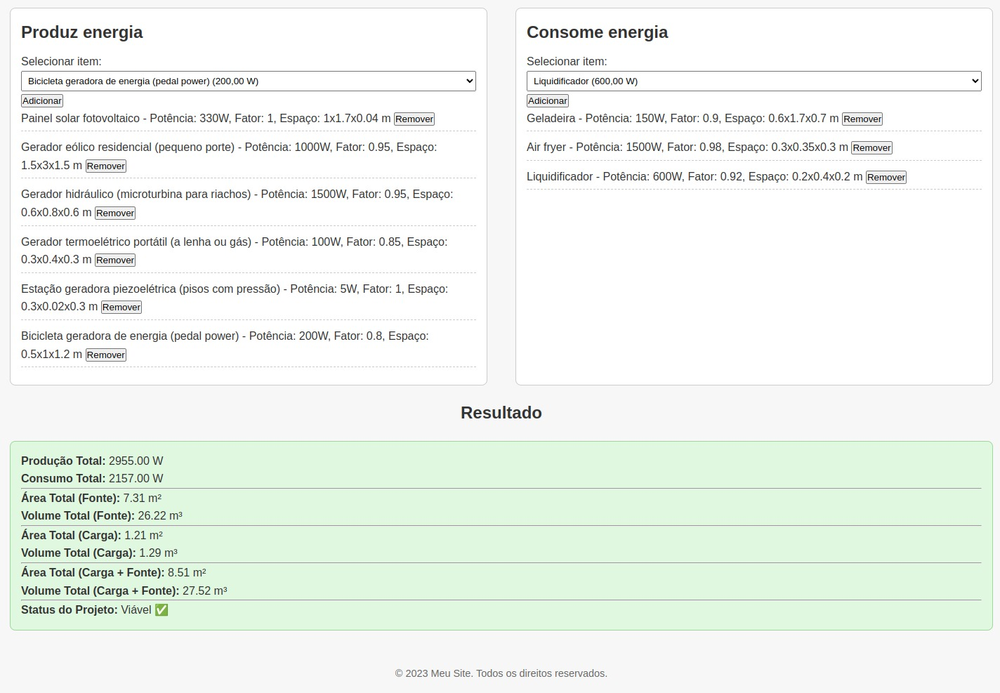
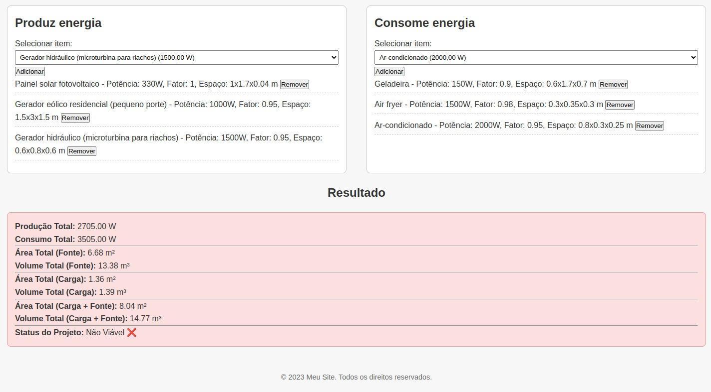

# Univesp PI 1

Projeto Integrador I

## Dependências

 * django 5.1.2
 * faker 30.8.1
 * mysqlclient 2.2.5
 * python-dotenv 1.0.1

## Participantes:

```
MARCELO ANDRADE DA SILVA
LUCAS CAMPOS ACHCAR
ANTONIO DONIZETE DRAGO
HENRY FERNANDO ESPINDOLA MARCONDES
LUIZ GUSTAVO MUNIZ MOTA PEREIRA
PIETRO SALLUM FERREIRA
CRISTINA SILVA GOMES RIBEIRO
JOSE WAGNER DE OLIVEIRA
```

## Demo do projeto

* [Link - site de demonstração](https://pi1-univesp.onrender.com/)

## Preview

<p float="left">
  
  
</p>

## Instalação e Configuração

Crie um ambiente virtual (venv) do python3 

```python3 -m venv .venv```

Faça o acesso do seu venv do python3

```source .venv/bin/activate```

Para mais detalhes acesse [venv](https://docs.python.org/pt-br/3/library/venv.html)

Entre na pasta do projeto 

```cd base_project```

Faça uma copia do ```base_project/.env-exemplo``` para ```base_project/.env```

Abra o ```base_project/.env``` e faça as configurações do MySQL

```
DEBUG_MODE=True

DB_NAME=project         # nome do banco de dados
DB_USER=seu_usuario     # usuário do banco de dados
DB_PASSWORD=sua_senha   # senha do banco de dados
DB_HOST=127.0.0.1       # ou o IP do servidor de banco de dados
DB_PORT=3306            # porta padrão do MySQL

DJANGO_SECRET_KEY="django-insecure-fl8su)fsgsisy-!y$cz-ff=*u4@7fxh)@o#3o2riesshqzqz%-"
CSRF_COOKIE_SECURE=False
```

Instalação das Dependências do Projeto

```pip install -r requirements.txt```

Esse comando irá instalar todas as dependências necessárias para
o funcionamento do projeto.

## Instalação de uma instância Docker MySQL

Entre na pasta ```mysql-docker``` e digite o seguinte comando

```docker compose up -d```

OBS: Certamente você deverá habilitar o uso externo do MySQL para o usuário 'root'
não irei explicar como se faz isso, caso não consiga, você pode usar outras alternativas
de instalação do MySQL, o processo não depende do método de instalação e sim do acesso ao MySQL. 

## Configuração das migrations do MySQL

Execute as migrations do DJango com o seguinte comando

```python manage.py makemigrations```

```python manage.py migrate```

```python manage.py migrate public_site --database=mysql_db```

Caso queira fazer testes, utilize o seguinte comando para gerar 'dados fakes

```python manage.py fake_data```

OBS: certifique que o MySQL esteja configurado corretamente para 
todos os comandos acima funcionarem corretamente

## Rodando o Projeto

Após feito toda a instalação e configuração, digite o seguinte comando no terminal
dentro da pasta ```base_project``` 

```python manage.py runserver```

O DJango irá dar acesso a página pelo ip ```http://127.0.0.1:8000/```
