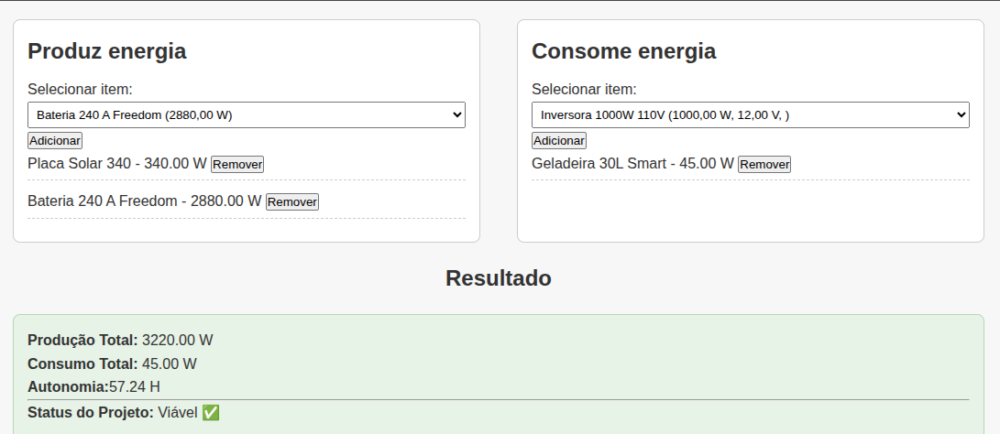
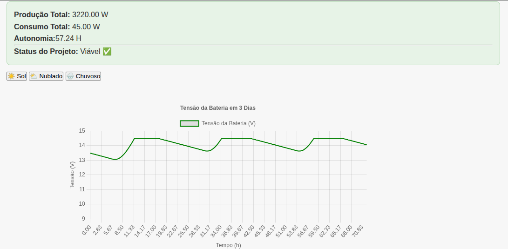

# Analise de Produção e consumo de Energia de Motor Homes

## Dependências

 * django 5.1.2
 * faker 30.8.1
 * mysqlclient 2.2.5
 * python-dotenv 1.0.1
 * whitenoise 6.9.0

## Autores:

```
LUCAS CAMPOS ACHCAR
HENRY FERNANDO ESPINDOLA MARCONDES
```

## Demo do projeto

http://127.0.0.1:8000/admin/

Usuário: Admin  senha: henry1234

## Preview

<p float="left">
  
  
</p>

## Instalação e Configuração

Para instalar o virtualenv no Linux Debian ou Ubuntu, utilize o comando 

```sudo apt install python3.12-venv ```
ou 

```pip install virtualenv```

Crie um ambiente virtual (venv) do python3 dentro da pasta raiz do projeto
~/pi1_univesp/  (caminho no Linux) 

```python3 -m venv .venv```

Este comando irá criar uma pasta oculta .venv/ com os binarios para executar o ambiente
virtual.

Faça o acesso do seu venv do python3

```source .venv/bin/activate```

Para mais detalhes acesse [venv](https://docs.python.org/pt-br/3/library/venv.html)

Entre na pasta do projeto 

```cd base_project```

Instalação das Dependências do Projeto

```pip install -r requirements.txt```

Esse comando irá instalar todas as dependências necessárias para
o funcionamento do projeto.

Caso tenha problemas para instalar mysqlclient no ubuntu, debian ou wsl(ubuntu)Windows

verifique se as dependências necessárias estão instaladas:
 pkg-config 
 libmysqlclient-dev
 python3-dev 
 build-essential 


## Configuração do .env

Faça uma copia do ```base_project/.env-exemplo``` para ```base_project/.env```

Abra o ```base_project/.env``` e faça as configurações do MySQL


## Configuração das migrations do MySQL

Execute as migrations do DJango com o seguinte comando

```python manage.py makemigrations```

```python manage.py migrate```

```python manage.py migrate public_site --database=mysql_db```

Caso queira fazer testes, utilize o seguinte comando para gerar 'dados fakes'

```python manage.py fake_data```

OBS: certifique que o MySQL esteja configurado corretamente para 
todos os comandos acima funcionarem corretamente

## Rodando o Projeto

Após feito toda a instalação e configuração, digite o 
seguinte comando no terminal dentro da pasta ```base_project``` 

```python3 manage.py runserver```

O DJango irá dar acesso a página pelo ip ```http://127.0.0.1:8000/```


